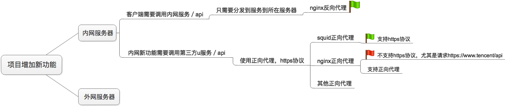
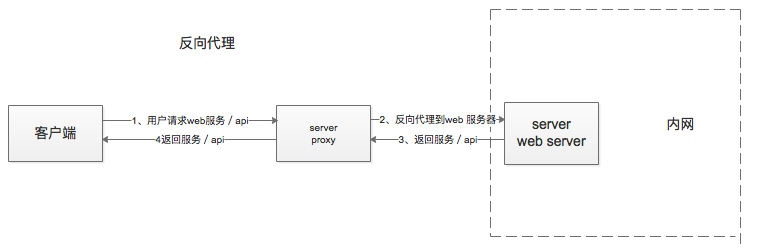
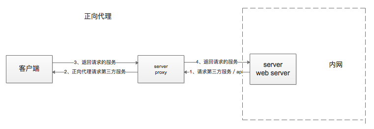

# nginx反向代理+squid正向代理
```
项目背景：一台代理服务器，一台内网服务器。内网服务器无法暴露在互联网，当用户需要内网服务器提供的服务时，
就可以通过nginx的反向代理来完成。当内网服务器需要调用第三方api时就需要使用正向代理，普通代理或者透明代理。
不要用任何方式把内网机器直接联网。
```






## nginx反向代理
### 1、代理服务器需要配置要代理到的内网的ip:port，更为复杂的nginx配置需要继续学习。

> 需要配置一个`server`，主要是监听的端口，和`location`中的`proxy_pass http://ip:port;` 这个ip:port就是要转到的内网服务器的ip和端口。

```
server {
            listen 80;
            server_name wxapp.jtgzfw.com;
#           rewrite ^(.*) http://125.46.83.203/404.html break;
            location / {
            proxy_pass http://125.46.83.198:8000;
            proxy_set_header Host $host;
            proxy_set_header X-Real-IP $remote_addr;
            proxy_set_header X-Forwarded-For $proxy_add_x_forwarded_for;
            proxy_set_header Cookie $http_cookie;
#           proxy_intercept_errors on;
        }

        #error_page 404 /404.html;
        #    location = /40x.html {
        #}

        error_page 500 502 503 504 /404.html;
            location = /40x.html {
        }
}
```


## squid正向代理
### 1、开启代理服务器端口

> 每当增加新功能时，可能需要新的端口支持程序的运行。对于squid来说，它需要一个新的端口来支持squid程序的运行，这个端口默认是2138，当然可以选择其他端口。
> 开启新的端口需要使用firewalld来完成，当然可以使用iptabels，但是强烈建议使用firewalld。为代理服务器增加端口12345的tcp访问，--permanent表示永久生效，如果不加这个就表示重启服务实效。--zone可以限定访问。也可以控制服务等。f

> $ sudo firewall-cmd --zone=public --add-port=12345/tcp --permanent

### 2、修改代理服务器squid配置文件
> 我们这里只需要一台机器连接代理服务器，所以需要注释掉前三个 `acl localnet src ip段`。然后增加一个allow host，`acl ecnu src 172.16.0.10`
> `http_access allow ecnu`。
> 

```
# Recommended minimum configuration:

# Example rule allowing access from your local networks.
# Adapt to list your (internal) IP networks from where browsing
# should be allowed
#acl localnet src 10.0.0.0/8    # RFC1918 possible internal network
#acl localnet src 172.16.0.0/12 # RFC1918 possible internal network
#acl localnet src 192.168.0.0/16        # RFC1918 possible internal network
acl ecnu src 172.16.0.10
http_access allow ecnu

acl localnet src fc00::/7       # RFC 4193 local private network range
acl localnet src fe80::/10      # RFC 4291 link-local (directly plugged) machines

acl SSL_ports port 443
acl Safe_ports port 80          # http
acl Safe_ports port 21          # ftp
acl Safe_ports port 443         # https
acl Safe_ports port 70          # gopher
acl Safe_ports port 210         # wais
acl Safe_ports port 1025-65535  # unregistered ports

```

### 3、项目ssh登陆到代理服务器
> 如果内网机器没有使用ssh登陆过代理服务器，但是我们的内网服务除了设置代理外又需要代理服务器的用户名和密码进行验证。
> 
> $ ssh proxy_username@proxy_ip
> 
> and then enter proxy_password

### 4、 修改项目的配置文件，指定ssh用户吗密码ip端口

> 所以在项目docker-compose.yml中配置时需要提供proxy服务器的`username:password@ip:port`，密码貌似不可以使用特殊字符。还没有验证是否可以加引号和转译符号。
> 

```
  web:
    image: env_wxfine:v0.2
    command: circusd wx_fine/deploy/circusd.ini
    hostname: weblocal
    volumes:
      - .:/code
      - ./static:/static
      - /var:/var
    ports:
      - "8000"
    links:
      - postgres:postgreshost
    environment:   # 注意新加的环境变量设置
      - http_proxy=proxy_username:proxy_password@proxy_ip:3128
      - https_proxy=proxy_username:proxy_password@proxy_ip:3128
      #- http_proxy=ip:3128
      #- https_proxy=ip:3128
    depends_on:
      - postgres

```

