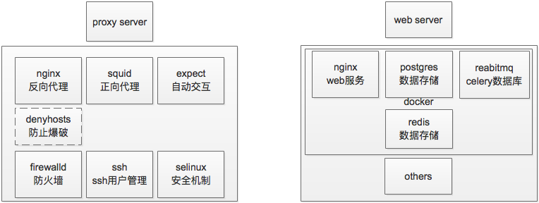

# 环境
`服务器环境介绍`

## proxy服务器环境
### 1、端口
> 代理服务器，系统默认是开放22端口的，并允许root用户登陆，但是这样有安全风险，不久前因为没有意识到，机器被人hack掉了，汲取教训，修改root用户密码，并且禁止root ssh登陆。

#### firewalld （推荐）
> centos防火墙软件，因为centos的端口平时都是拒绝外部访问的，所以即使有进程在使用端口也不能与外部通讯，当需要使用新的端口时需要使用firewalld允许新的端口通讯。

#### iptables （不推荐）
> centos自带防火墙软件，修改配置文件需要重启，当通过service和systemctl命令无法重启进程时，需要找到启动文件然后restart。建议使用firewalld进行管理。

#### selinux
> centos安全机制，尤其是502 bad gateway这样的错误，很可能是端口的问题，如果开启的端口还是502 bad gateway那就很有可能是selinux在保护系统，需要关闭selinux后再开启。

### 2、工具
> 代理服务器需要安装代理软件来提供代理服务，根据业务的请求方，可以分为正向代理和反向代理。反向代理就是外部请求我们的服务或api；正向代理就是我们的服务需要调用第三方服务或者api。

#### nginx
> nginx的功能很强大，可以作为代理软件，也可以作为web服务软件，提供负载均衡等，这里使用nginx提供反向代理服务。虽然nginx也可以提供正向代理，但是nginx对正向代理的支持有限，尤其是不怎么好的支持https，不满足业务需求。

#### squid
> 一款正向代理软件，功能完善，满足业务需求，为我们提供正向代理服务。

### expect
> shell编程工具，提供自动交互式操作。

### 3、ssh
> 前面提到禁止root ssh登陆就是这个，对于ssh其实可以指定只允许某些ip的主机访问，但是因为我们也是在局域网，ip可能会改变，所以索性直接禁止root用户ssh登陆。为了安全考虑，打算使用一款denyhosts工具，可以将暴力破解的ip禁止登陆。提高系统安全性。

### 4、用户
> 用户和用户组的权限管理，需要ssh用户账号和密码需要有长度和复杂性要求，提供一个具有root权限的用户账户，需要使用root权限时加sudo操作，对于只允许root操作的操作才需要登陆root。另外还需要提供ftp账号用户ftp服务，目前没有开启ftp服务。

### 与其他联系
> 主机与服务所在主机通讯。

## web服务环境
centos环境大部分环境与代理服务器相同，只是需要提供其他服务。
### 1、ftp服务
> 因为项目的特殊性，我们并不能直接从数据库操作数据，所以需要需要使用ftp服务把需要的操作转化为文件，在另一端也需要提供ftp服务，把文件解析后进行操作。目前只进行数据同步操作。和数据写入redis操作

### 2、docker
> 为了项目管理的方便和环境隔离，使用docker作为项目允许环境。所有服务运行与docker内部，当项目增加新功时只需要另起一份容器。

### 3、web服务

#### nginx
> web的HTTP服务器角色，接受处理web请求。

#### postgres
> 项目数据存放。

#### rabbitmq
> celery异步及定时任务数据库。

### 数据同步服务
> 基本与web服务所用环境一样，需要提供redis作为存储服务。请求数据同步，解析文件内容并将数据写入redis。
