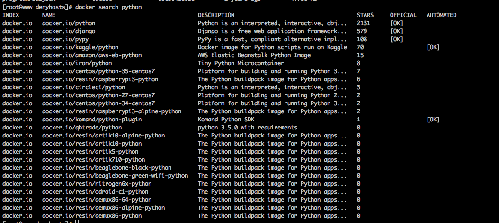
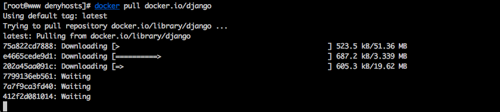
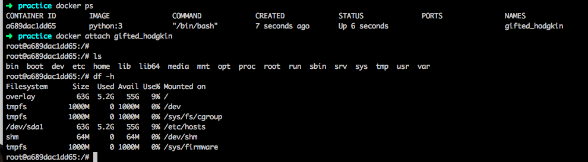
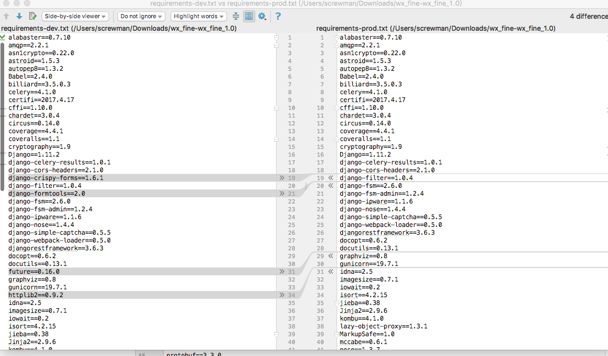
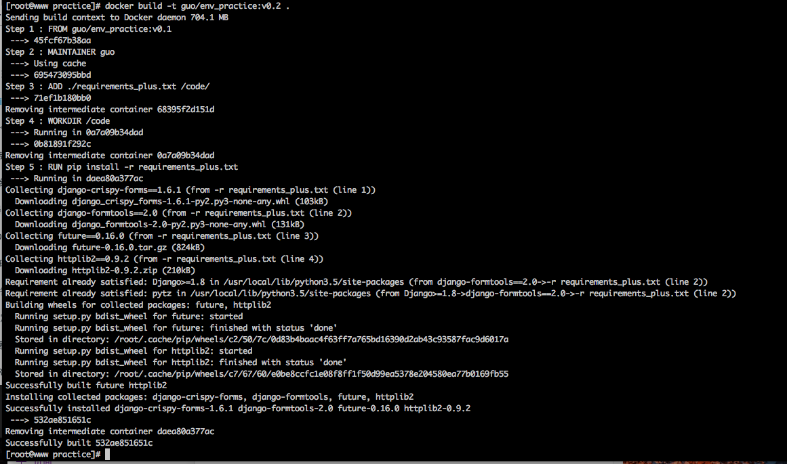

docker 允许原理，镜像是什么。docker是如何管理container的，能不能实现一个docker。
# 给一个django项目制作docker运行环境

## 1 基础镜像

django是python下的框架，要想使用Django框架必须使用python安装django模块。
首先需要一个python镜像。

`docker pull python:v3.6`

然后在python:v3.6镜像的基础之上安装django模块。这里需要制作镜像，要使用dockerfile。

FROM python:v1
RUN pip install django

当然也可以直接下载官方封装好的带Django的python镜像。

`docker search python`



> `docker pull docker.io/django`
> 
> `docker pull docker.io/python`



And then waitting for download complited!! Okey, it will costs a lot of time!!!

## 2 项目使用了哪些python模块
作为程序开发人员，为了实现某一个功能，一般会使用某些新的模块。

这些模块一般是通过pip进行安装，程序员在本地使用虚拟python环境进行开发，

要导出项目使用的模块，可以使用命令把依赖导出到一个文件。

> `$ pip freeze > requirements.txt`

这里要与程序员沟通，因为项目可能有多个requirements.txt文件，通过询问，选择正确的requirements.txt

这会生成一个文件，叫做requrirements.txt，文件中是各个模块的名称还有版本，一行一条记录。

根据这个requirements.txt，我们就可以制作项目的运行环境镜像，还是使用dockerfile文件以及命令docker build -t name:v1 .

[编写Dockerfile](./dockerfile.md)

从国外下载镜像会非常的慢，所以最好配置国内的镜像源，当然，如果有本地的镜像源就更好了。

docker需要下载安装requirements.txt中给出的模块，所以，如果程序需要的环境非常的多，那么可能会非常的花时间。

大概花了15分钟。


在dockerfile中，我们可以设置工作目录，当然首先要查看镜像的目录结构，一般可以先运行镜像，

> $ docker run -itd image ／bin/bash

然后 

> $ docker attach containername

之后会进入交互式命令行，ls进行查看。
以后项目的操作目录就是这里的目录，如果想要把文件写到计算机中的某一个目录，就需要使用volunme进行挂载。当然考虑到还需要其他像数据库之类的镜像，考虑使用docker-compose对容器进行管理。



如果项目需要增加新的某块
编写dockerfile文件

```
FROM env_project:v0.1
WORDIR /code
ADD ./requirements_plus.txt /code
RUN pip install -r requirements_plus.txt
```

> `$ docker build -t env_project:v0.2 .`
> 

找出requirements.txt文件新增的module
`使用pycharm的文件比较功能`
右键文件，选择compare with后选择一个要比较的文件。



然后编写dockerfile文件和requirements_plus.txt



## 3 项目使用了其他的镜像
项目要运行，当然需要使用数据库来支持，又可能使用多个数据库。
数据库镜像在官方都有。可以直接

> $ docker pull postgres

需要给数据库名字、账号、密码，这里就建议使用docker-compose的.yml进行配置。

作为web应用还需要关键的nginx作为http服务器

> $ docker pull nginx

## 4 编写docker-compose.yml文件

docker-compose.yml的作用很大，尤其是项目使用多个镜像，并需要这几个容器直接需要互相通讯、暴露端口、挂载目录等。

[编写docker-compose.yml](./docker-compose.yml.md)

尤其是当我们项目使用了celery异步任务和circues、gunircon启动程序，配置起来要注意。proxy环境变量也要注意，数据库变量也要注意，nginx配置文件也要注意。


