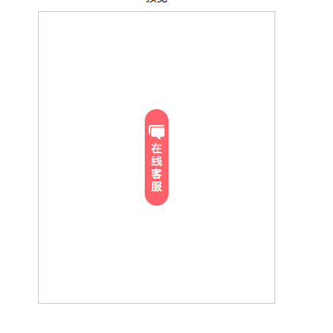
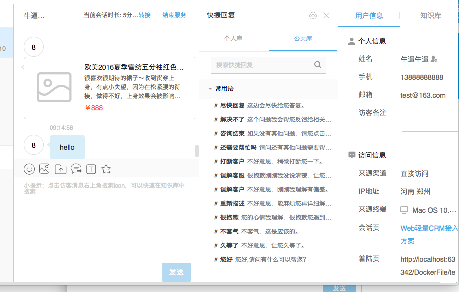

# 网易七鱼

作为第三方在线客服聊天系统，可以很方便的将客服功能集成到我们的系统。
多平台的接入：web接入，微信公众号接入，app接入

### 1 客服与用户的聊天功能

- 配置是否在客户端显示聊天功能入口
- 配置入口在客户端显示的样式
- 配置对话框显示形式和样式
- 配置是否使用机器人聊天

#### 客户端入口显示样式

#### 客户端打开后样式(3种样式，这里是使用web方式显示)
- 分别是 浮层样式、弹窗样式、标签样式

#### 机器人聊天与人工聊天
- 如果开启机器人聊天，就会由机器人回答用户问题，这里需要预先设置机器人要回答的问题关键字。

- 当用户选择人工服务时，如果此时没有客服在线就会进入留言模块，客服在线时可以看到留言。

- 用户接入时客服的分配可以随机，也可以指定客服组和客服。

#### 客服界面

- 1 表示客服正在交流的用户，可以同时与多个用户沟通
- 2 发送给七鱼服务器的数据，主要有两种：标记2的订单信息 标记4的客户信息
- 3 用户发送的信息
- 4 发送给七鱼服务器的数据
- 5 用户端信息

- 6 快捷回复 
- 7 转接
- 8 结束服务

##### 此外还有 用户留言、历史会话、会话监控、设置知识库(帮助客服和机器人回答用户问题)

### 相关设置部分

- 客服的管理

	添加客服时，可以为客服分组和选择角色，角色对应不同的权限。
	
> 角色管理

> 分组管理

	
> 客服管理
	

- 满意度设置、留言设置、咨询分类、会话分配、敏感词设置、会话超时设置
	
	在会话结束前后，用户可以对服务进行评价
	
	是否开启留言功能。当用户使用人工客服功能时，如果此时没有人工客服在线就会使用留言功能。
	
	客服对用户的咨询进行分类
	
	是否启用历史会话（用户会被分配给上一次服务他的客服），是否开始技能优先分配（客户会优先分配给技能高的客服)
	
	当客户和客服输入文字时，可以检测敏感词，需要添加敏感词。
	
	当长时间没有新的消息就会自动关闭会话，会收到提示语。
	

- 机器人问题模板设置 （设置问题回答，相似问题关键字）

- 快捷回复设置 （回复用语设置）

客服可以添加自己的快捷回复，也可以使用公用的快捷回复

	
- 智能监控设置（敏感词添加、相应超时报警、会话超时报警、满意度选项设置）

- 访客分配 （接入客服的方式，指定或者不指定客服）

- 会话邀请 （主动邀请用户联系客服，设置信息模板）

- 客户vip设置 （对客户等级划分 1-10）

这个是一个开关

- 添加用户黑名单 （用户将无法使用客服功能）

- 知识库 （用户问题和答案的库，包括客服的常用语，问题和答案添加，相似词库添加等）

- 会话报表统计

